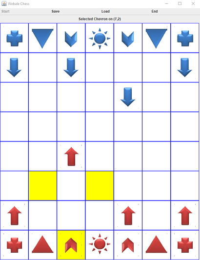

# Webale Chess Game

This project is a Webale Chess game which is a GUI-based Java Application chess game with a dimension of 7 x 8.



## Webale Chess Pieces

### The Sun
The Sun can only move one step in any direction. The game ends when the Sun is captured by the other side.

### Chevron
The Chevron moves in an L shape: 2 steps in one direction then 1 step perpendicular to it. (Similar to the Knight in the normal chess.) It is the only piece that can skip over the other pieces.

### Triangle
The Triangle can move any number of steps diagonally.

### Plus
The Plus can move any number of steps up and down, or left and right.

### Arrow
The Arrow can only move 1 or 2 steps forward each time, but when it reaches the other edge of the board, it turns around and heads back in the opposite direction.

## Special Features
Every 2 rounds of each team, all its Triangle pieces will transform to Plus pieces and vice versa.

## Requirements
- Java version 1.8.0_261 or above
- Javac 1.8.0_261 or above
- Bash Command (Preferably Git Bash)


## Compilation and running the game

### Recommended Way

```bash

# To compile and package the .jar file
$ ./compile.sh

# To run the game
$ ./run.sh

```

### Build Manually

```bash

# Clear the /target directory if exists
$ rm -r target

# Make target directories
$ mkdir -p target/bin

# Compile the classes
$ javac -d ./target/bin -cp ./src ./src/me/samoa/chess/Main.java

# Copy resource pack into built path
$ cp -r src/resources target/bin/

# Package the whole thing
$ jar cfm target/Game.jar manifest.txt -C target/bin .

# To run the game
$ java -jar target/Game.jar

```
## Contributors
<table>
  <tr>
    <td align="center"><a href="https://github.com/manyimy"><br /><sub><b>manyimy</b></sub>
    </td>
    <td align="center"><a href="https://github.com/SJinggg"><br /><sub><b>SJinggg</b></sub>
    </td>
    <td align="center"><a href="https://github.com/KimHyungna"><br /><sub><b>KimHyungna</b></sub>
    </td>
    <td align="center"><a href="https://github.com/keishidesu"><br /><sub><b>keishidesu</b></sub>
    </td
  </tr>
<table>
